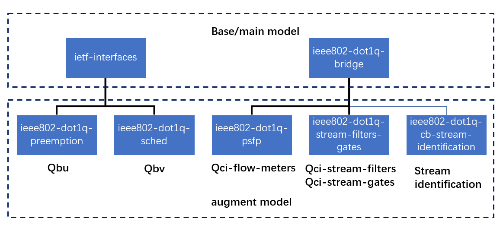

# transAPI
## 1 Introduction

The purpose of this project is to implement the transAPI part of [netopeer](https://github.com/CESNET/netopeer). transAPI plays the role of parsing and applying configuration and getting device status.

In this project, we use tsn related models from [yang](https://github.com/YangModels/yang), like [ieee802-dot1q-preemption.yang](https://github.com/YangModels/yang/tree/master/standard/ieee/draft/802.1/Qcw), as our models' source to creat netopeer transAPI. The transAPI together with netopeer server in the device to can implement tsn configuration based on NETCONF protocol.


## 2 yang models

Project mainly uses following models:
  - [ietf-interfaces@2014-05-08.yang](https://github.com/YangModels/yang/blob/master/standard/ietf/RFC/ietf-interfaces%402014-05-08.yang)
  - [ieee802-dot1q-preemption.yang](https://github.com/YangModels/yang/blob/master/standard/ieee/draft/802.1/Qcw/ieee802-dot1q-preemption.yang)
  - [ieee802-dot1q-sched.yang](https://github.com/YangModels/yang/blob/master/standard/ieee/draft/802.1/Qcw/ieee802-dot1q-sched.yang)
  - [ieee802-dot1q-bridge.yang](https://github.com/YangModels/yang/blob/master/standard/ieee/published/802.1/ieee802-dot1q-bridge.yang)
  - [ieee802-dot1q-stream-filters-gates.yang](https://github.com/YangModels/yang/blob/master/standard/ieee/draft/802.1/Qcr/ieee802-dot1q-stream-filters-gates.yang)
  - [ieee802-dot1q-psfp.yang](https://github.com/YangModels/yang/blob/master/standard/ieee/draft/802.1/Qcw/ieee802-dot1q-psfp.yang)
  - [ieee802-dot1q-cb-stream-identification.yang](./cfgbridges/ieee802-dot1q-cb-stream-identification.yang)

Where, **ietf-interfaces@2014-05-08.yang** and **ieee802-dot1q-bridge.yang** are base model.

**ietf-interfaces@2014-05-08.yang** defines the **ietf-interfaces** model, and **ieee802-dot1q-bridge.yang** defines the **ieee802-dot1q-bridge** model.

**ieee802-dot1q-preemption.yang** and **ieee802-dot1q-sched.yang** are augment models of **ietf-interfaces@2014-05-08.yang**. **ieee802-dot1q-preemption.yang** adds qbu feature. **ieee802-dot1q-sched.yang** adds qbv feature.

**ieee802-dot1q-stream-filters-gates.yang** and **ieee802-dot1q-psfp.yang** are augment models of **ieee802-dot1q-bridge**. **ieee802-dot1q-stream-filters-gates.yang** adds stream-filters and stream-gates feature. **ieee802-dot1q-psfp.yang** adds qci-flow-meters feature and some supplements to stream-filters and stream-gate.

Especially, because there have no models about 802.1CB in [yang](https://github.com/YangModels/yang), we add **ieee802-dot1q-cb-stream-identification.yang** which based on *IEEE P802.1CB™/D2.8*. It will be replaced when [yang](https://github.com/YangModels/yang) adds related models.

Flowing picture shows relationship between these models:



Folowing files show detail model's nodes information:

- [ietf-interface-model-tree](./cfginterfaces/interfaces-tree.txt)
- [ieee802-dot1q-bridge](./cfgbridges/bridges-tree.txt)

## 3 transAPI source files

It's structure is as below:
```
transAPI
│
│───cfgbridges			// Source files of transAPI cfgbridges
│   |   bridges.c
│   |   bridges.h
│   |   ieee802-dot1q-cb-stream-identification.yang
│   └─examples			// Instance examples
│       |   qci_instance.xml
│
│───cfgbridges-cb		// Source files of parsing cb configuration
│   |   parse_cb_node.h
│   |   parse_cb_node.c
│   └─examples			// Instance examples
│       |   stream_id_instance.xml
│
│───cfgbridges-qci		// Source files of parsing qci configuration
│   |   parse_qci_node.h
│   |   parse_qci_node.c
│   └─examples			// Instance examples
│       |   flow_meters_instance.xml
│       |   strean_filters_instance.xml
│       |   stream_gates_instance.xml
│
│───common			// Common APIs For all transAPIs running on the device
│   |  json_node_access.c	// APIs to access json node
│   |  json_node_access.h
│   |  xml_node_access.c	// APIs to access xml node
│   |  xml_node_access.h
│
│───platform			// Definitions and APIs dependent on specific platform
│   |  platform.c
│   |  platform.h
│
│───cfginterfaces		// Source files of transAPI cfginterfaces
│   |  interface.c
│   |  interface.h
│   └─examples			// Instance examples
│       |   qbv_qbu_instance.xml
│
│───cfginterfaces-qbv		// Source files of parsing qbv configuration
│   |  parse_qbv_node.c
│   |  parse_qbv_node.h
│   └─examples			// Instance examples
│       |   qbv_instance.xml
│
└───cfginterfaces-qbu		// Source files of parsing qbu configuration
    |  parse_qbu_node.c
    |  parse_qbu_node.h
    └─examples			// Instance examples
        |   qbu_instance.xml
```
Now, there have two transAPIs **cfgbridges** and **cfginterfaces**. TSN features like qbv, qbu and qci, are are part of these two transAPIs.

## 4 Installing netopeer-cli on Ubuntu16.04

1. Install the following packages:

```
$ sudo apt-get install -y libtool python-argparse libtool-bin python-sphinx libffi-dev libxml2-dev libxslt1-dev
$ sudo apt-get install -y libcurl4-openssl-dev xsltproc python-setuptools cmake zlib1g-dev libssl-dev python-libxml2
$ sudo apt-get install -y libaugeas-dev openssh-server libreadline-dev python-dev pkg-config
```

2. Install pyang:

```
$ git clone https://github.com/mbj4668/pyang.git
$ cd pyang
$ sudo python setup.py install
```

---
NOTE: There is a version issue for libssh installation on Ubuntu below version 16.04. Apt-get install libssh may get version 0.6.4. But libnetconf needs a version of 0.7.3 or later. Remove the default one and reinstall by downloading the source code and installing it manually.
****

```
$ git clone https://git.libssh.org/projects/libssh.git
$ cd libssh
$ mkdir build
$ cd build/
$ cmake ..
$ make
$ sudo make install
```

3. Pull, configure, make, and install libnetconf:

```
$ git clone https://github.com/CESNET/libnetconf.git
$ cd libnetconf
$ ./configure
$ sudo make
$ sudo make install
```

4. Pull netopeer and configure, make, and install cli:

```
$ git clone https://github.com/CESNET/netopeer.git
$ cd netopeer/cli
$ ./configure
$ make
$ sudo make install
```

## 5 Enable netopeer-server in LS1028ARDB
Build the image with OpenIL using following commands:
* $ cd openil
* $ make clean
* $ make nxp_ls1028ardb-64b_defconfig
* $ make -j8

Then **transapi** and packages it depends on will be enabled in the image.

## 6 Configure TSN function of LS1028ARDB
Netopeer-server will start as a daemon process if the board use the image mentioned above. User can kill it, and run **netopeer-server -v 3** for verbose mode.

In our example, we will use instance files in this repo, please clone it to the pc, and start our example in this ropo's directory.

After board powered up, we can start our journey to configure TSN funciotn of LS1028ARDB.
### 6.1 Connect to netopeer-server
Get the ip of LS1028ARDB, here we use 10.193.20.55 as an example. Then run following command on ubuntu pc to start netopeer-cli and connect to netopeer-server:

For first time to connect to netopeer-server, netopeer-cli need to create host key for authentication:
```
	$ netopeer-cli
	netconf> connect --login root 10.193.20.55
	The authenticity of the host '10.193.20.55' cannot be established.
	ssh-rsa key fingerprint is 9b:00:0d:f1:4a:8e:3a:59:bf:6b:7b:f1:b3:e2:32:63:71:e7:18:cc.
	Are you sure you want to continue connecting (yes/no)? yes
	root@10.193.20.55 password:
	netconf>
```

If you get following message:
```
	libnetconf ERROR: Remote host key changed, the connection will be terminated!
	libnetconf ERROR: Checking the host key failed.
```

You need to input command *quit* in netopeer-cli first, and remove the old host key with **ssh-keygen -R 10.193.20.55** command.

### 6.2 Configure Qbv and get the configuration
```
	netconf> edit-config --defop replace --config cfginterfaces-qbv/examples/qbv_instance.xml running
	  Result OK
	netconf> get-config running
	 Result:
	<if:interfaces xmlns:if="urn:ietf:params:xml:ns:yang:ietf-interfaces" xmlns:sched="urn:ieee:std:802.1Q:yang:ieee802-dot1q-sched">
	  <interface xmlns="urn:ietf:params:xml:ns:yang:ietf-interfaces">
		<name>swp2</name>
		<enabled>true</enabled>
		<sched:max-sdu-table>
			<sched:traffic-class>0</sched:traffic-class>
			<sched:queue-max-sdu>1024</sched:queue-max-sdu>
		</sched:max-sdu-table>
		<sched:gate-parameters>
			<sched:gate-enabled>true</sched:gate-enabled>
			<sched:admin-gate-states>0xff</sched:admin-gate-states>
			<sched:config-change>true</sched:config-change>
			<sched:admin-control-list-length>3</sched:admin-control-list-length>
			<sched:admin-cycle-time>
				<sched:numerator>61000</sched:numerator>
				<sched:denominator>1000000000</sched:denominator>
			</sched:admin-cycle-time>
			<sched:admin-control-list>
				<sched:index>0</sched:index>
				<sched:operation-name>sched:set-gate-states</sched:operation-name>
				<sched:sgs-params>
					<sched:gate-states-value>0x03</sched:gate-states-value>
					<sched:time-interval-value>5000</sched:time-interval-value>
				</sched:sgs-params>
			</sched:admin-control-list>
			<sched:admin-control-list>
				<sched:index>1</sched:index>
				<sched:operation-name>sched:set-gate-states</sched:operation-name>
				<sched:sgs-params>
					<sched:gate-states-value>0xef</sched:gate-states-value>
					<sched:time-interval-value>6000</sched:time-interval-value>
				</sched:sgs-params>
			</sched:admin-control-list>
			<sched:admin-control-list>
				<sched:index>2</sched:index>
				<sched:operation-name>sched:set-gate-states</sched:operation-name>
				<sched:sgs-params>
					<sched:gate-states-value>0xff</sched:gate-states-value>
					<sched:time-interval-value>50000</sched:time-interval-value>
				</sched:sgs-params>
			</sched:admin-control-list>
		</sched:gate-parameters>
	  </interface>

	......

	</if:interfaces><netopeer xmlns="urn:cesnet:tmc:netopeer:1.0">
	  <modules>
		<module>
			<name>cfginterfaces</name>
			<enabled>true</enabled>
		</module>
		<module>
			<name>cfgbridges</name>
			<enabled>true</enabled>
		</module>
	  </modules>
	</netopeer>
	netconf>
```
### 6.3 Set configuration in running as the default configuration
```
	netconf> copy-config --source running startup
	  Result OK
	netconf>
```

Then every time after rebooting the board, this configuration will be set.
### 6.4 exit netopeer-cli
```
	netconf> quit
```
---
NOTE: There have some differents between cfginterfacs module and cfgbridges module. Cfginterfaces moduel support to configure the module based on port, and the instance file doesn't need to contain the whole configuration data when usd **edit-config --defop replace** command. But cfgbridges moduel doesn't support this operation yet, when **edit-config --defop replace** command is used, instance file must contain all of the configuration, otherwise, other configuration will be flushed.
****
